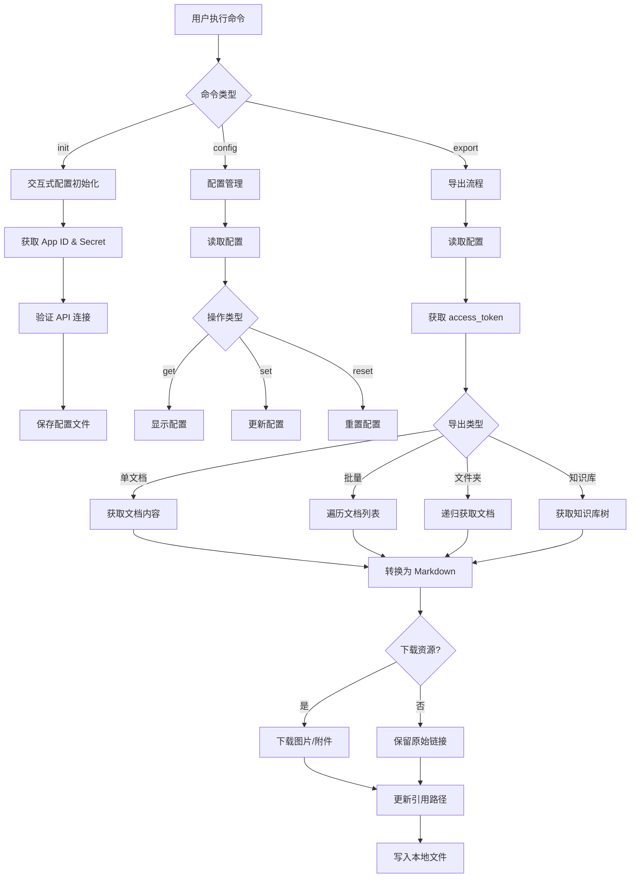

# 技术方案：小遥搜索飞书导出工具

## 一、技术选型

### 核心运行时
| 组件 | 选择 | 理由 |
|------|------|------|
| 运行时 | Node.js 18.x+ | 成熟稳定，跨平台兼容性好，npm 生态丰富 |
| 编程语言 | TypeScript | 类型安全，IDE 支持好，大型项目可维护性强 |

### CLI 框架与工具
| 组件 | 选择 | 理由 |
|------|------|------|
| CLI 框架 | Commander.js | 成熟稳定，API 简洁，社区活跃 |
| 进度显示 | cli-progress | 支持多种进度条样式，兼容性好 |
| 命令行交互 | inquirer | 交互式配置初始化体验好 |
| 参数解析 | commander 内置 | 无需额外依赖 |

### HTTP 与 API
| 组件 | 选择 | 理由 |
|------|------|------|
| HTTP 客户端 | axios | 支持拦截器处理 Token，API 简洁 |
| 速率限制 | bottleneck | 令牌桶算法实现，避免 API 限流 |

### 文件与配置
| 组件 | 选择 | 理由 |
|------|------|------|
| 配置管理 | cosmiconfig | 支持多种配置文件格式，约定优于配置 |
| 文件操作 | fs-extra | Node.js fs 的增强版，API 更友好 |
| 路径处理 | path (内置) | 跨平台路径兼容 |

### Markdown 转换
| 组件 | 选择 | 理由 |
|------|------|------|
| HTML → MD | turndown | 飞书 API 返回富文本 HTML，转换质量高 |
| 表情符号 | he | HTML 实体解码，处理飞书表情 |

### 日志
| 组件 | 选择 | 理由 |
|------|------|------|
| 日志框架 | winston | 支持多输出、日志分级、日志轮转 |

### 开发工具
| 组件 | 选择 | 理由 |
|------|------|------|
| 包管理 | pnpm | 节省磁盘空间，安装速度快 |
| 构建工具 | esbuild / tsup | 快速打包，支持多平台二进制编译 |
| 代码规范 | ESLint + Prettier | 统一代码风格 |
| 类型检查 | TypeScript | 编译时类型检查 |
| 测试框架 | Vitest | 快速，兼容 Jest API |

### 构建与发布
| 组件 | 选择 | 理由 |
|------|------|------|
| 二进制打包 | pkg / nexe | 将 Node.js 项目打包为独立可执行文件 |
| npm 发布 | npm | 标准发布流程 |
| CI/CD | GitHub Actions | 自动化构建、测试、发布 |

---

## 二、系统架构图

### 2.1 整体架构

```
┌─────────────────────────────────────────────────────────────────┐
│                         用户 (CLI)                               │
└───────────────────────────┬─────────────────────────────────────┘
                            │
                            ▼
┌─────────────────────────────────────────────────────────────────┐
│                      CLI 入口层                                  │
│  ┌──────────────┐  ┌──────────────┐  ┌──────────────┐          │
│  │   init 命令   │  │   config 命令 │  │  export 命令 │          │
│  └──────────────┘  └──────────────┘  └──────────────┘          │
└───────────────────────────┬─────────────────────────────────────┘
                            │
        ┌───────────────────┼───────────────────┐
        ▼                   ▼                   ▼
┌───────────────┐   ┌───────────────┐   ┌───────────────┐
│  配置管理模块   │   │  认证授权模块   │   │  导出核心模块   │
│  - 初始化配置   │   │  - 获取 Token │   │  - 文档导出    │
│  - 读取/更新   │   │  - Token 刷新 │   │  - 知识库导出  │
└───────────────┘   └───────────────┘   └───────────────┘
                                                │
        ┌───────────────────────────────────────┼───────────────────┐
        ▼                                       ▼                   ▼
┌───────────────┐   ┌───────────────┐   ┌───────────────┐   ┌───────────────┐
│  并发控制模块   │   │  进度显示模块   │   │  Markdown转换 │   │  资源下载模块   │
│  - 速率限制     │   │  - 进度条      │   │  - 富文本转换 │   │  - 图片下载    │
│  - 重试机制     │   │  - 日志输出    │   │  - 表格处理  │   │  - 附件下载    │
└───────────────┘   └───────────────┘   └───────────────┘   └───────────────┘
        │                   │                   │                   │
        └───────────────────┴───────────────────┴───────────────────┘
                            │
                            ▼
┌─────────────────────────────────────────────────────────────────┐
│                      本地文件系统                                 │
│  ~/.feishu-export/          输出目录/                            │
│  ├── config.json           ├── 文档夹/                            │
│  ├── meta.json             │   ├── xxx.md                        │
│  └── logs/                 │   └── assets/                       │
│                              └── 知识库/                          │
└─────────────────────────────────────────────────────────────────┘
                            │
                            ▼
┌─────────────────────────────────────────────────────────────────┐
│                    飞书开放平台 API                               │
│  - 认证 API (tenant_access_token)                                │
│  - 文档 API (获取文档块)                                          │
│  - 知识库 API (获取节点)                                          │
│  - 媒体 API (下载图片/附件)                                       │
└─────────────────────────────────────────────────────────────────┘
```

### 2.2 数据流程图



---

## 三、数据存储设计

### 3.1 配置文件 (~/.feishu-export/config.json)

```json
{
  "profiles": {
    "default": {
      "appId": "cli_xxxxxxxxx",
      "appSecret": "xxxxxxxxxxxxxxxx",
      "endpoint": "https://open.feishu.cn",
      "outputDir": "./output"
    },
    "work": {
      "appId": "cli_yyyyyyyyy",
      "appSecret": "yyyyyyyyyyyyyyyy",
      "endpoint": "https://open.feishu.cn",
      "outputDir": "./work-output"
    }
  },
  "currentProfile": "default"
}
```

### 3.2 元数据文件 (~/.feishu-export/meta.json)

用于增量导出，记录文档更新时间：

```json
{
  "lastExportAt": "2026-03-27T10:30:00Z",
  "documents": {
    "doxcnAbCdEfGhIjKlMnOpQrStUv": {
      "title": "示例文档",
      "updatedAt": "2026-03-27T09:00:00Z",
      "exportedAt": "2026-03-27T10:30:00Z",
      "outputPath": "./output/example.md",
      "version": 1
    }
  },
  "folders": {},
  "wikis": {}
}
```

### 3.3 缓存文件 (~/.feishu-export/cache.json)

缓存 access_token 避免频繁刷新：

```json
{
  "accessToken": "t-xxxxxxxxxxxxxxxx",
  "expiresAt": 1698451200000
}
```

---

## 四、核心 API 交互设计

### 4.1 飞书 API 调用流程

#### 获取 tenant_access_token

```typescript
// POST https://open.feishu.cn/open-apis/auth/v3/tenant_access_token/internal
Request:
{
  "app_id": "cli_xxxxxxxxx",
  "app_secret": "xxxxxxxxxxxxxxxx"
}

Response:
{
  "code": 0,
  "tenant_access_token": "t-xxxxxxxxxxxxxxxx",
  "expire": 7200
}
```

#### 获取文档块列表

```typescript
// GET https://open.feishu.cn/open-apis/docx/v1/documents/{document_id}/blocks/{block_id}/children
Request Headers:
  Authorization: Bearer {tenant_access_token}

Response:
{
  "code": 0,
  "data": {
    "items": [
      {
        "block_id": "doxcnxxxxxxxx",
        "block_type": 1,
        "text": { "elements": [...] }
      }
    ],
    "has_more": false
  }
}
```

#### 下载媒体文件

```typescript
// GET https://open.feishu.cn/open-apis/drive/v1/permissions/{file_token}/download
Request Headers:
  Authorization: Bearer {tenant_access_token}

Response: 重定向到文件下载地址
```

### 4.2 速率限制策略

| API 类型 | 限流规则 | 工具适配策略 |
|---------|---------|-------------|
| tenant_access_token | 100次/分钟 | 本地缓存，7200秒内不重复请求 |
| 文档内容 API | 5次/秒 | 使用 bottleneck，并发限制为3 |
| 媒体下载 API | 10次/秒 | 使用瓶颈队列，并发限制为5 |

---

## 五、项目目录结构

```
feishu-export/
├── src/                        # 源代码目录
│   ├── commands/              # CLI 命令定义
│   │   ├── init.ts           # init 命令
│   │   ├── config.ts         # config 命令
│   │   ├── export.ts         # export 相关命令
│   │   └── index.ts          # 命令注册入口
│   ├── core/                  # 核心业务逻辑
│   │   ├── auth.ts           # 认证模块
│   │   ├── document.ts       # 文档获取模块
│   │   ├── wiki.ts           # 知识库模块
│   │   └── media.ts          # 媒体下载模块
│   ├── converter/             # 格式转换
│   │   ├── markdown.ts       # Markdown 转换器
│   │   └── types.ts          # 类型定义
│   ├── utils/                 # 工具模块
│   │   ├── config.ts         # 配置管理
│   │   ├── rate-limiter.ts   # 速率限制
│   │   ├── progress.ts       # 进度显示
│   │   ├── logger.ts         # 日志工具
│   │   └── file.ts           # 文件操作
│   ├── types/                 # TypeScript 类型
│   │   └── index.ts          # 全局类型定义
│   └── index.ts              # 主入口文件
├── bin/                       # 可执行文件
│   └── feishu-export         # CLI 入口（软链接）
├── tests/                     # 测试文件
│   ├── unit/                 # 单元测试
│   ├── integration/          # 集成测试
│   └── fixtures/             # 测试数据
├── scripts/                   # 构建脚本
│   └── build.ts              # 构建脚本
├── .env.example               # 环境变量示例
├── .gitignore
├── package.json
├── tsconfig.json
├── pnpm-lock.yaml
├── README.md
├── LICENSE
└── docs/                      # 文档目录
    ├── 00-mrd.md
    ├── 01-prd.md
    └── 03-技术方案.md
```

---

## 六、关键模块设计

### 6.1 配置管理模块 (utils/config.ts)

```typescript
interface ConfigProfile {
  appId: string;
  appSecret: string;
  endpoint: string;
  outputDir: string;
  concurrency?: number;
  timeout?: number;
}

interface Config {
  profiles: Record<string, ConfigProfile>;
  currentProfile: string;
}

class ConfigManager {
  private configPath: string;
  private config: Config;

  async init(): Promise<void>;
  async get(key?: string): Promise<any>;
  async set(key: string, value: any): Promise<void>;
  async reset(): Promise<void>;
  getProfile(name: string): ConfigProfile;
}
```

### 6.2 认证模块 (core/auth.ts)

```typescript
class AuthManager {
  private tokenCache: { token: string; expiresAt: number } | null;

  async getAccessToken(): Promise<string>;
  async refreshToken(): Promise<string>;
  private saveTokenCache(): void;
  private loadTokenCache(): void;
}
```

### 6.3 并发控制模块 (utils/rate-limiter.ts)

```typescript
class RateLimiter {
  private limiter: Bottleneck;

  constructor(options: { concurrency: number; minTime: number });
  async schedule<T>(fn: () => Promise<T>): Promise<T>;
}

// 使用示例
const apiLimiter = new RateLimiter({
  concurrency: 3,        // 最大并发数
  minTime: 200           // 每次请求最小间隔
});
```

### 6.4 Markdown 转换模块 (converter/markdown.ts)

```typescript
class MarkdownConverter {
  private turndownService: TurndownService;

  constructor();
  convertBlock(block: FeishuBlock): string;
  convertDocument(blocks: FeishuBlock[]): string;
  convertRichText(elements: TextElement[]): string;
  private convertTable(block: TableBlock): string;
  private convertCodeBlock(block: CodeBlock): string;
}
```

---

## 七、错误处理与重试策略

### 7.1 错误分类

| 错误类型 | HTTP 状态码 | 处理策略 |
|---------|------------|---------|
| 认证失败 | 401 | 刷新 Token 后重试 |
| 权限不足 | 403 | 记录失败，跳过 |
| 资源不存在 | 404 | 记录失败，跳过 |
| API 限流 | 429 | 等待后重试 |
| 网络错误 | ECONNRESET | 重试（最多3次） |
| 超时 | ETIMEDOUT | 重试（最多3次） |

### 7.2 重试策略

```typescript
class RetryHandler {
  async retry<T>(
    fn: () => Promise<T>,
    options: {
      maxRetries: number;      // 最大重试次数
      backoffMultiplier: number; // 退避倍数
      initialDelay: number;    // 初始延迟
    }
  ): Promise<T>;
}
```

---

## 八、第三方服务依赖

| 服务 | 用途 | 备选方案 |
|------|------|---------|
| 飞书开放平台 API | 核心数据源 | 无（必须依赖） |
| npm registry | 包发布 | GitHub Release |
| GitHub Actions | CI/CD | GitLab CI |
| GitHub Releases | 二进制发布 | 自建 CDN |

---

## 九、技术风险评估

| 风险 | 影响 | 概率 | 应对方案 |
|------|------|------|---------|
| 飞书 API 变更 | 高 | 中 | 版本锁定，定期检查更新 |
| API 限流导致批量导出慢 | 中 | 高 | 实现速率限制，支持断点续传 |
| 大文档内存占用高 | 中 | 中 | 流式处理，分块导出 |
| 跨平台路径问题 | 低 | 中 | 使用 path 模块，测试覆盖 |
| Token 泄露风险 | 高 | 低 | 配置文件加密存储，日志脱敏 |

---

## 十、开发环境

### 10.1 本地开发

```bash
# 安装依赖
pnpm install

# 开发模式（监听文件变化）
pnpm dev

# 运行 CLI
pnpm start export -d <doc_id>

# 运行测试
pnpm test

# 类型检查
pnpm type-check

# 代码检查
pnpm lint
```

### 10.2 构建与发布

```bash
# 构建
pnpm build

# 打包为可执行文件
pnpm build:binary

# 发布到 npm
pnpm publish
```

### 10.3 CI/CD 流程

```yaml
# GitHub Actions workflow
name: CI/CD
on: [push, pull_request]

jobs:
  test:
    - 运行单元测试
    - 运行集成测试
    - 类型检查

  build:
    - 构建项目
    - 打包多平台二进制文件
    - 发布 GitHub Release（tag 时）

  publish:
    - 发布到 npm（tag 时）
```

---

## 十一、技术债务记录

- [ ] **Token 刷新机制优化** - 当前使用简单过期时间判断，未来可考虑预刷新
- [ ] **流式处理大文档** - 当前一次性加载所有块，大文档可能内存溢出
- [ ] **断点续传优化** - 增量导出可以更精确地比较文档版本
- [ ] **配置文件加密** - App Secret 当前明文存储，可考虑加密
- [ ] **多语言支持** - 当前仅中文提示，未来可支持英文

---

## 十二、版本规划

### v0.1.0 (MVP)
- 基础配置管理
- 单文档导出
- 知识库单节点导出
- 图片下载（可选）

### v0.2.0
- 批量文档导出
- 文件夹导出
- 增量导出
- 进度条和详细日志

### v0.3.0
- 完整知识库导出
- 附件下载
- 断点续传

### v1.0.0
- 多平台二进制发布
- 完整测试覆盖
- 稳定的 API 兼容性

---

**创建日期：** 2026-03-27
**基于 PRD：** [01-prd.md](./01-prd.md)
**参考项目：** [老项目分析.md](../olds/老项目分析.md)
**预计开发时间：** 4-5周（MVP）
**技术负责人：** 待定
